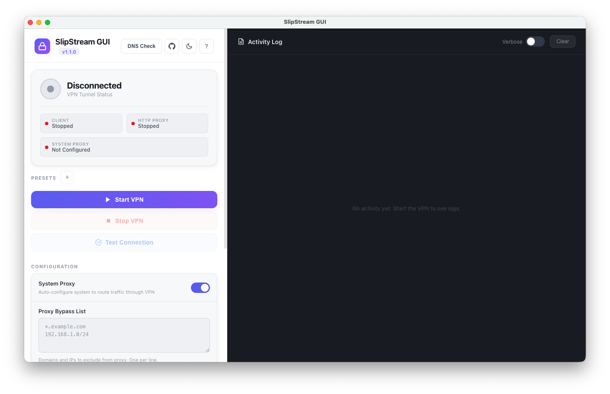

# SlipStream GUI


<div align="center">
  
</div>


<div align="center">
  
  
  
  <a href="https://github.com/mirzaaghazadeh/SlipStreamGUI/releases/latest">
    
  </a>
  
</div>

<br>

<div align="center">
  <a href="README-EN.md">📄 Simple User Guide (English)</a>
  <br><br>


  <a href="README-FA.md">📄 راهنما ساده استفاده (فارسی)</a>
</div>

<br>

<div align="center">
  <strong>A modern, cross-platform GUI client for SlipStream VPN</strong><br>
  Provides secure, system-wide tunneling through an HTTP proxy interface
</div>


---

## 👀 Tour

- **Install** the app from the latest release
- **Set your server** (`Domain`) and `DNS Resolver` (or keep defaults for testing)
- **DNS Checker (optional)**: run it, and click **"Use"** on any **OK** row to set your `DNS Resolver`
- **Start VPN** and watch the **Status** indicators turn “Running”
- **Verify** with “Test Proxy Connection” and check the **Logs** panel if needed
- **Optional**: Share your VPN over Wi‑Fi to your phone using the built-in HTTP proxy (`8080`)

## 📥 Download & Install

### Latest Release

<div align="center">
  <a href="https://github.com/mirzaaghazadeh/SlipStreamGUI/releases/latest">
    
  </a>
</div>

**Direct downloads (latest release):**

| Platform | Download |
|----------|----------|
| macOS (Apple Silicon) | [SlipStream-GUI-macOS-ARM64.dmg](https://github.com/mirzaaghazadeh/SlipStreamGUI/releases/latest/download/SlipStream-GUI-macOS-ARM64.dmg) |
| macOS (Intel) | [SlipStream-GUI-macOS-Intel.dmg](https://github.com/mirzaaghazadeh/SlipStreamGUI/releases/latest/download/SlipStream-GUI-macOS-Intel.dmg) |
| Windows (64-bit) Installer | [SlipStream-GUI-Windows-x64.exe](https://github.com/mirzaaghazadeh/SlipStreamGUI/releases/latest/download/SlipStream-GUI-Windows-x64.exe) |
| Windows (64-bit) Portable | [SlipStream-GUI-Windows-x64-Portable.exe](https://github.com/mirzaaghazadeh/SlipStreamGUI/releases/latest/download/SlipStream-GUI-Windows-x64-Portable.exe) |
| Windows (32-bit) Installer | [SlipStream-GUI-Windows-x86.exe](https://github.com/mirzaaghazadeh/SlipStreamGUI/releases/latest/download/SlipStream-GUI-Windows-x86.exe) |
| Windows (32-bit) Portable | [SlipStream-GUI-Windows-x86-Portable.exe](https://github.com/mirzaaghazadeh/SlipStreamGUI/releases/latest/download/SlipStream-GUI-Windows-x86-Portable.exe) |
| Linux (x86_64) AppImage | [SlipStream-GUI-Linux-x64.AppImage](https://github.com/mirzaaghazadeh/SlipStreamGUI/releases/latest/download/SlipStream-GUI-Linux-x64.AppImage) |
| Linux (x86_64) DEB | [SlipStream-GUI-Linux-x64.deb](https://github.com/mirzaaghazadeh/SlipStreamGUI/releases/latest/download/SlipStream-GUI-Linux-x64.deb) |

If a direct download fails, use the [Releases page](https://github.com/mirzaaghazadeh/SlipStreamGUI/releases/latest).

### Quick Install

1. **Download** the latest release for your platform from the [Releases page](https://github.com/mirzaaghazadeh/SlipStreamGUI/releases/latest)
2. **Install** the application (double-click the installer)
3. **Run** the app and click "Start VPN"

That's it! No additional setup required.

---

## 🚀 Quick Start Guide

### First Time Setup

1. **Launch SlipStream GUI** after installation

2. **Configure Settings** (optional):
   - **DNS Resolver**: Your DNS server (default: `8.8.8.8:53`)
   - **Domain**: Your SlipStream server domain (default: `s.example.com`)
   - **System Proxy**: Toggle to auto-configure system proxy (recommended)
   - **Proxy Bypass List**: Add domains or IPs to exclude from the proxy (one per line, e.g. `*.google.com`, `192.168.1.0/24`)

3. **DNS Checker (optional, recommended if you're unsure about DNS)**:
   - Click **"DNS Checker"**
   - Enter a **test domain** (example: `google.com`)
   - Enter one or more **DNS server IPs** to test (you can paste large lists; up to **100 servers** are checked in parallel)
   - **OK = OK** (no action needed)
   - Click **"Use"** on any **OK** row to auto-set your **DNS Resolver** (the app will force port `53`)

4. **Start the VPN**:
   - Click the **"Start VPN"** button
   - Wait for status indicators to show "Running"
   - Your traffic is now routed through SlipStream!

### Using the VPN

- **Status Panel**: Monitor connection status in real-time
- **Logs Panel**: View connection activity and debug information
- **Verbose Logging**: Toggle detailed logs for troubleshooting
- **Test Connection**: Use the "Test Proxy Connection" button to verify functionality
- **Stop VPN**: Click "Stop VPN" when you want to disconnect

### Setting Up a SlipStream Server

To use SlipStream GUI, you need a SlipStream server running. For detailed instructions on deploying your own SlipStream server, check out:

🔗 **[slipstream-rust-deploy](https://github.com/AliRezaBeigy/slipstream-rust-deploy)**

This repository provides a one-click deployment script for setting up a SlipStream server, including:

- ✅ **One-command installation**: Automated server deployment
- ✅ **DNS configuration guide**: Step-by-step DNS setup instructions
- ✅ **Multiple deployment modes**: SOCKS proxy or SSH tunneling
- ✅ **Prebuilt binaries**: Fast installation for supported platforms
- ✅ **Systemd integration**: Automatic service management
- ✅ **TLS certificates**: Automatic certificate generation

**Quick Server Setup:**

```bash
# One-command server installation
bash <(curl -Ls https://raw.githubusercontent.com/AliRezaBeigy/slipstream-rust-deploy/master/slipstream-rust-deploy.sh)
```

**What You'll Need:**
- A Linux server (Fedora, Rocky, CentOS, Debian, or Ubuntu)
- A domain name with DNS access
- Root or sudo access on the server

**After Server Setup:**
1. Configure your DNS records (see the [slipstream-rust-deploy](https://github.com/AliRezaBeigy/slipstream-rust-deploy) repository for detailed DNS setup)
2. Wait for DNS propagation (can take up to 24 hours)
3. In SlipStream GUI, enter your server domain (e.g., `s.example.com`)
4. Enter your DNS resolver (e.g., `YOUR_SERVER_IP:53`)
5. Click "Start VPN" to connect!

---

## ✨ Features

- 🖥️ **Cross-Platform**: Native support for macOS, Windows, and Linux
- 🔒 **System-Wide VPN**: Routes all traffic through SlipStream VPN
- 🎨 **Modern GUI**: Intuitive interface with real-time status and logs
- ⚙️ **Auto-Configuration**: Automatically configures system proxy settings
- 🚫 **Proxy Bypass List**: Exclude specific domains or addresses from the proxy (split tunneling)
- 📦 **Self-Contained**: All dependencies bundled (no internet required after installation)
- 💼 **Portable Mode**: Windows portable version available (no installation required)
- 🔍 **Verbose Logging**: Optional detailed logging for debugging
- 🧪 **Connection Testing**: Built-in proxy connection tester
- 📊 **Real-Time Status**: Monitor VPN connection status at a glance
 - 🌐 **Concurrent DNS Checker**: Tests many DNS servers at once and lets you apply any **OK** result with one click

---

## 📱 Sharing PC Internet via Mobile (Same Network)

If your PC and mobile device are on the same Wi-Fi network, you can configure your mobile device to use your PC's internet connection (including the VPN) through the proxy.

### Prerequisites

- PC and mobile device must be connected to the same Wi-Fi network
- SlipStream GUI must be running with VPN started
- Find your PC's local IP address (see instructions below)

### Finding Your PC's IP Address

**macOS/Linux:**
```bash
# Open Terminal and run:
ifconfig | grep "inet " | grep -v 127.0.0.1
# or
ip addr show
```

**Windows:**
```cmd
# Open Command Prompt and run:
ipconfig
# Look for "IPv4 Address" under your active network adapter
```

The IP address will typically look like `192.168.1.XXX` or `10.0.0.XXX`.

### 📱 iOS Configuration

1. On your iPhone/iPad, go to **Settings** → **Wi-Fi**
2. Tap the **(i)** icon next to your connected Wi-Fi network
3. Scroll down to **"HTTP Proxy"** section
4. Select **"Manual"**
5. Enter your PC's IP address in **"Server"** field (e.g., `192.168.1.100`)
6. Enter **"8080"** in the **"Port"** field
7. Leave **"Authentication"** off
8. Tap **"Save"** in the top right

**Note:** Your iOS device will now route all internet traffic through your PC's VPN connection. To disable, go back to Wi-Fi settings and set HTTP Proxy to "Off".

### 🤖 Android Configuration

1. On your Android device, go to **Settings** → **Wi-Fi**
2. Long-press on your connected Wi-Fi network
3. Select **"Modify network"** or **"Network details"**
4. Tap **"Advanced options"** or expand the advanced settings
5. Under **"Proxy"**, select **"Manual"**
6. Enter your PC's IP address in **"Proxy hostname"** (e.g., `192.168.1.100`)
7. Enter **"8080"** in **"Proxy port"**
8. Leave **"Bypass proxy for"** empty (or add local addresses like `localhost,127.0.0.1`)
9. Tap **"Save"**

**Note:** Some Android versions may have slightly different menu paths. If you can't find these options, try: **Settings** → **Network & Internet** → **Wi-Fi** → (tap network) → **Advanced** → **Proxy**.

**To disable:** Go back to Wi-Fi settings, modify the network, and set Proxy back to "None".

### ⚠️ Important Notes

- Make sure your PC's firewall allows incoming connections on port 8080
- The proxy only works while both devices are on the same network
- If your PC's IP address changes, you'll need to update the proxy settings on your mobile device
- Some apps may bypass system proxy settings - you may need to configure them individually

---

## 🐛 Troubleshooting

### macOS: "SlipStream GUI is damaged and can't be opened"

If you see this error when trying to open the app on macOS, it's usually due to macOS Gatekeeper security settings. Here's how to fix it:

**Option 1: Remove the quarantine attribute (Recommended)**
```bash
# Open Terminal and run:
xattr -cr /Applications/SlipStream\ GUI.app
```

Then try opening the app again.

**Option 2: Allow the app in System Settings**
1. Go to **System Settings** → **Privacy & Security**
2. Scroll down to the **Security** section
3. If you see a message about "SlipStream GUI" being blocked, click **"Open Anyway"**
4. Confirm by clicking **"Open"** in the dialog

**Option 3: Right-click to open**
1. Right-click (or Control-click) on the SlipStream GUI app
2. Select **"Open"** from the context menu
3. Click **"Open"** in the confirmation dialog

After the first successful launch, macOS will remember your choice and you won't see this error again.

### Windows: Run as Administrator

For best functionality on Windows, especially when configuring system proxy settings, run SlipStream GUI as Administrator:

**Option 1: Right-click method**
1. Right-click on the SlipStream GUI shortcut or executable
2. Select **"Run as administrator"**
3. Click **"Yes"** in the User Account Control (UAC) prompt

**Option 2: Always run as administrator**
1. Right-click on the SlipStream GUI shortcut
2. Select **"Properties"**
3. Go to the **"Compatibility"** tab
4. Check **"Run this program as an administrator"**
5. Click **"OK"**

**Note:** Running as administrator is recommended for automatic system proxy configuration. The app will work without admin privileges, but you may need to configure proxy settings manually.

### VPN won't start

- Check that ports 8080 and 5201 are not in use
- Verify your DNS resolver and domain settings
- Check the logs panel for error messages
- On Windows, try running as Administrator (see above)

### System proxy not working

- Ensure the "Configure System Proxy" toggle is enabled
- On macOS, you may be prompted for administrator password
- On Windows, run the app as Administrator for automatic configuration
- Some apps may bypass system proxy (configure them manually)

### Connection issues

- Use the "Test Proxy Connection" button to verify functionality
- Enable verbose logging for detailed connection information
- Check that your SlipStream server domain is correct

---

## 👨‍💻 For Developers

### Prerequisites

- Node.js 16+ and npm
- Git

### Installation

```bash
# Clone the repository
git clone https://github.com/mirzaaghazadeh/SlipStreamGUI.git
cd SlipStreamGUI

# Install dependencies
npm install
```

### Development

```bash
# Download the latest SlipStream client binaries (recommended)
npm run download:binaries

# Run in development mode
npm start
```

### Building

```bash
# Download the latest SlipStream client binaries (recommended)
npm run download:binaries

# Build for macOS
npm run build:mac

# Build for Windows (installer + portable)
npm run build:win

# Build for Windows (portable only)
npm run build:win:portable

# Build for Linux
npm run build:linux

# Build for all platforms
npm run build:all
```

Built applications will be in the `dist/` folder.

For detailed build instructions, see [BUILD.md](BUILD.md).

---

## 📖 How It Works

SlipStream GUI creates a multi-layer proxy architecture:

```
Your Applications
    ↓ HTTP/HTTPS
HTTP Proxy Server (127.0.0.1:8080)
    ↓ SOCKS5 Protocol
SOCKS5 Client (127.0.0.1:5201)
    ↓ Encrypted Tunnel
SlipStream VPN Server
```

### Architecture

1. **SlipStream Client**: Runs the native binary (`binaries/slipstream-client-mac-arm64` / `binaries/slipstream-client-mac-intel`, `binaries/slipstream-client-win.exe`, or `binaries/slipstream-client-linux`) that establishes a SOCKS5 proxy on port 5201
2. **HTTP Proxy Server**: Node.js server listening on port 8080 that converts HTTP requests to SOCKS5
3. **System Proxy**: Automatically configures system proxy settings to route all traffic through the VPN

---

## 📁 Project Structure

```
SlipStream-GUI/
├── assets/              # App icons and images
│   └── icon.png
├── main.js              # Electron main process
├── index.html           # UI and renderer process
├── check-system-proxy.js # System proxy status checker
├── package.json         # Dependencies and build config
├── BUILD.md            # Detailed build instructions
├── README.md           # This file
└── .gitignore          # Git ignore rules
```

For detailed project structure, see [PROJECT_STRUCTURE.md](PROJECT_STRUCTURE.md).

---

## 🔧 Technical Details

### Technologies

- **Electron**: Cross-platform desktop framework
- **Node.js**: Backend runtime
- **HTTP Proxy**: Node.js HTTP module for proxy server
- **SOCKS5**: Protocol for VPN tunneling
- **IPC**: Inter-process communication between main and renderer

### Ports

- **8080**: HTTP Proxy Server
- **5201**: SOCKS5 Proxy (SlipStream client)

### Configuration

Settings are stored in `settings.json` (created automatically):
- DNS Resolver
- Domain
- Verbose logging preference
- Proxy bypass list (domains/addresses excluded from proxy)
- SOCKS5 authentication credentials

---

## 📝 Requirements

- **macOS**: 10.13+ (High Sierra or later)
- **Windows**: Windows 10 or later
- **Linux**: Most modern distributions (AppImage works on most, DEB for Debian/Ubuntu-based)
- **No special privileges**: Works immediately after installation
- **No internet required**: After installation, everything is self-contained

---

## 🤝 Contributing

Contributions are welcome! Please feel free to submit a Pull Request.

1. Fork the repository
2. Create your feature branch (`git checkout -b feature/AmazingFeature`)
3. Commit your changes (`git commit -m 'Add some AmazingFeature'`)
4. Push to the branch (`git push origin feature/AmazingFeature`)
5. Open a Pull Request

For detailed contribution guidelines, see [CONTRIBUTING.md](CONTRIBUTING.md).

---

## 📄 License

This project is licensed under the MIT License - see the [LICENSE](LICENSE) file for details.

---

## 🔗 Related Projects

- **[slipstream-rust-deploy](https://github.com/AliRezaBeigy/slipstream-rust-deploy)**: Deploy your own SlipStream server

---

## 🙏 Acknowledgments

- Built with [Electron](https://www.electronjs.org/)
- Uses [electron-builder](https://www.electron.build/) for packaging

---

<div align="center">
  <strong>Made with ❤️ for those we remember</strong>
</div>
